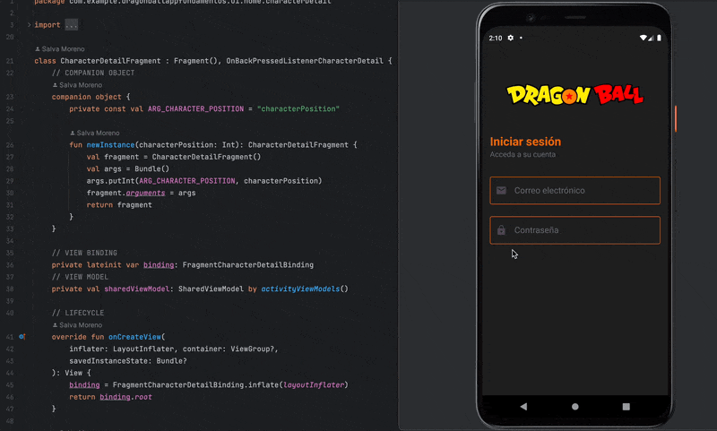

<h1 align="center">
  <strong>Bootcamp Desarrollo de Apps Móviles </strong>
</h1>

---

  <strong>Módulo: Fundamentos Android 🤖</strong>

---

  <strong>Autor:</strong> Salva Moreno Sánchez

  

## Índice
 
* [Herramientas](#herramientas)
* [Proyecto: Dragon Ball Heroes App](#proyecto)
	* [Descripción](#descripcion)
	* [Requisitos](#requisitos)
		* [Obligatorios](#obligatorios)
		* [Opcionales](#opcionales)
	* [Diseño](#diseno) 
	* [Problemas, decisiones y resolución](#problemas)

## Herramientas

  
 
  
 
  

* **Android SDK:** API 24 ("Nougat"; Android 7.0)
* **Kotlin:** 1.9
* **Android Studio:** Hedgehog - 2023.1.1

## Proyecto: Dragon Ball Heroes App

<h1 align="center">
  <strong>🚨⬇️ POR REDACTAR ⬇️🚨 </strong>
</h1>

### Descripción

### Requisitos

#### Obligatorios

#### Opcionales

### Diseño

### Problemas, decisiones y resolución

---

[Subir ⬆️](#top)

---

